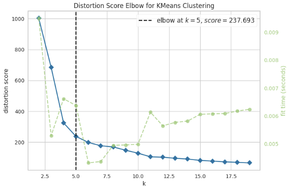
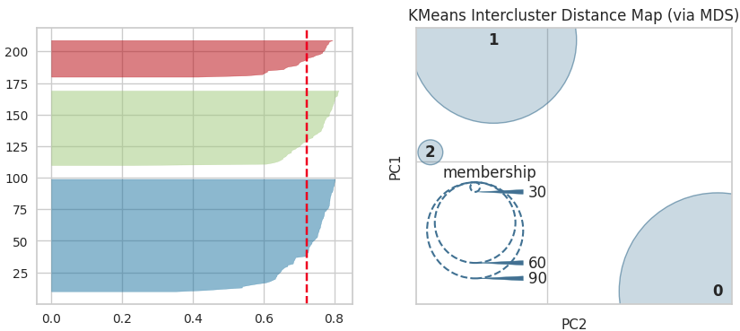
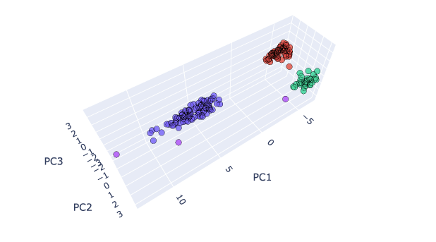
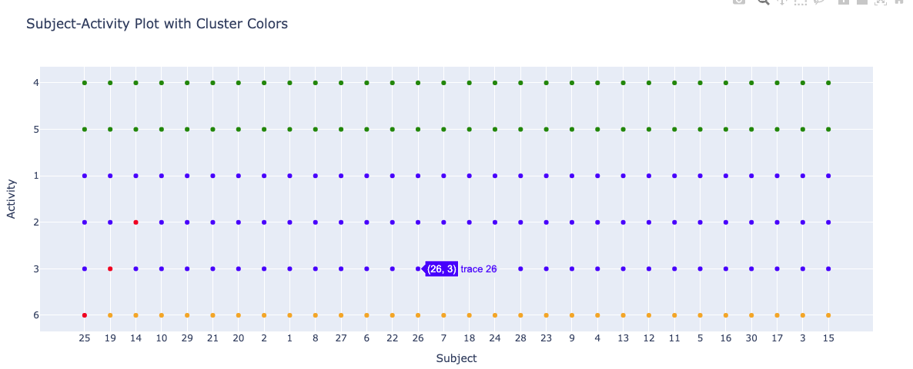

# Clustering Analysis Report

## Introduction

This project presents the findings of a clustering analysis conducted on various datasets using different algorithms and techniques. The aim was to explore the effectiveness of clustering in organizing and understanding complex datasets.

## Dataset
Human Activity Recognition database built from the recordings of 30 subjects performing activities of daily living (ADL) while carrying a waist-mounted smartphone with embedded inertial sensors.[Link](https://archive.ics.uci.edu/dataset/240/human+activity+recognition+using+smartphones)

## Dimensionality Reduction with PCA

Clustering algorithms such as KMeans and DBSCAN struggle with high-dimensional data. To mitigate this, Principal Component Analysis (PCA) was employed to reduce dimensionality while retaining critical information.

We observed a decrease in cumulative explained variance as the number of components was reduced across different datasets, indicating the trade-off between dimensionality reduction and information preservation.

## Clustering Results
### KMeans with PCA

### DBSCAN with PCA

Visual inspection suggests that DBSCAN effectively categorizes the data into ambulatory activities (related to walking), rest postures (related to standing and sitting), and stationary activities (related to lying down) for nearly all participating subjects.

## Conclusion

In conclusion, clustering analysis, particularly when combined with dimensionality reduction techniques like PCA, offers valuable insights into complex datasets. However, the choice of algorithm, granularity of data, and visualization methods significantly influence the interpretation of results.

